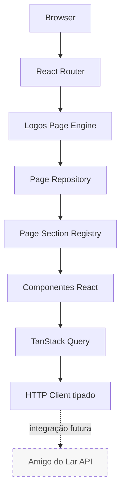

# Amigo do Lar v2

Aplicação frontend comercial para apresentação e captação de contatos de serviços residenciais em Brasília. O projeto usa o **Logos Page Engine** para compor páginas a partir de contratos tipados, com foco em SEO técnico, renderização estática e preparação para integração progressiva com uma API.

[](https://react.dev/)
[](https://www.typescriptlang.org/)
[](https://vite.dev/)
[](https://vitest.dev/)
[](https://github.com/lookjota/amigo-do-lar-v2/actions/workflows/ci.yml)
[](https://amigo-do-lar-v2.vercel.app)
[](LICENSE.md)

## Links principais

- [Aplicação em produção](https://amigo-do-lar-v2.vercel.app)
- [Repositório no GitHub](https://github.com/lookjota/amigo-do-lar-v2)
- [Arquitetura](docs/ARCHITECTURE.md)
- [Desenvolvimento](docs/DEVELOPMENT.md)
- [SEO](docs/SEO.md)
- [Roadmap](docs/ROADMAP.md)
- [Deploy](docs/DEPLOYMENT.md)

## Visão geral do produto

O Amigo do Lar apresenta serviços residenciais para pessoas que precisam resolver pequenas demandas de manutenção com uma comunicação clara sobre escopo, região e próximos passos. O catálogo atual cobre elétrica, hidráulica, montagem de móveis, fechaduras e portas, pintura e pequenos reparos.

A experiência pública reúne páginas específicas por serviço, páginas locais para áreas atendidas, conteúdo institucional, perguntas frequentes e informações legais. Seu objetivo comercial é transformar buscas e visitas em contatos qualificados. Hoje, o WhatsApp é o principal canal operacional para triagem e solicitação de atendimento.

O frontend também possui um formulário e uma mutation preparados para enviar solicitações à API. Como a persistência depende de um backend externo e de um contrato ainda provisório, esse fluxo não é apresentado como uma integração completa; em caso de falha, a interface oferece continuidade pelo WhatsApp.

## Demonstração

A versão publicada pode ser acessada em [amigo-do-lar-v2.vercel.app](https://amigo-do-lar-v2.vercel.app). O repositório não mantém uma captura de tela versionada neste momento.

## Destaques técnicos

### Arquitetura

- páginas descritas por modelos de domínio tipados;
- Logos Page Engine com `PageRenderer`, registry e componentes de seção;
- rotas e navegação separadas do conteúdo renderizável;
- catálogo estático centralizado para serviços e áreas;
- camadas compartilhadas sem dependência de React para contratos de domínio.

### SEO

- SSR durante o build e prerenderização de 23 rotas públicas;
- title, description, canonical, Open Graph, Twitter Card e robots por rota;
- JSON-LD coerente com o conteúdo exibido;
- geração automática de `sitemap.xml` e `robots.txt`;
- validação automatizada do HTML gerado.

### Qualidade

- TypeScript e ESLint;
- Vitest, jsdom e React Testing Library;
- testes de infraestrutura HTTP, erros, cache e componentes de navegação;
- CI em pushes e pull requests para `main`.

### Integração

- cliente HTTP tipado baseado em `fetch`;
- timeout, cancelamento e erros técnicos diferenciados;
- tradução centralizada de falhas para mensagens seguras de interface;
- TanStack Query configurado para cache, retry e mutations;
- contratos de API explicitamente provisórios.

### Deploy

- build de cliente e SSR com Vite;
- saída estática em `dist/`;
- hospedagem na Vercel com fallback para rotas da SPA;
- deploy de produção conectado à branch `main` pela integração nativa da Vercel.

## Arquitetura



O fluxo Browser → componentes está em produção. TanStack Query, o cliente HTTP e a mutation de orçamento já formam a fundação de integração. O catálogo principal ainda é local, e a API completa permanece como evolução planejada.

Consulte [docs/ARCHITECTURE.md](docs/ARCHITECTURE.md) para responsabilidades de camadas e fluxo de renderização.

## Estratégia de SEO

O comando de build gera dois bundles: cliente e servidor. A entrada SSR renderiza cada página com `renderToString`; em seguida, o prerender injeta o markup e a metadata específica em arquivos HTML estáticos. O resultado contém conteúdo principal antes da execução do JavaScript e continua navegável como SPA após a hidratação.

As 23 rotas públicas são a fonte comum para roteamento, prerender e sitemap. A validação final verifica, entre outros pontos, existência e unicidade de metadata, canonical correto, um único H1, diretivas de robots e JSON-LD válido. A página 404 é gerada separadamente com `noindex`.

Detalhes e limitações estão em [docs/SEO.md](docs/SEO.md).

## Stack

| Área | Tecnologias |
| --- | --- |
| Frontend | React 19, TypeScript, Vite, React Router, Tailwind CSS, Framer Motion, Lucide React |
| Dados e integração | TanStack Query, `fetch`, Zod, contratos TypeScript |
| Qualidade | ESLint, Vitest, jsdom, React Testing Library |
| Infraestrutura | GitHub Actions, SSR de build, prerenderização estática, Vercel |

## Estrutura de pastas

```text
src/
├── apps/amigo-do-lar/   # composição, conteúdo e interface do produto
├── domain/              # contratos de páginas, metadata e navegação
├── engine/              # pipeline genérico do Logos Page Engine
├── shared/http/         # cliente HTTP e erros de transporte
└── test/                # infraestrutura compartilhada de testes
scripts/                 # SEO, prerender e utilitários de build
docs/                    # arquitetura, desenvolvimento e decisões
.github/                 # CI e templates de colaboração
public/                  # arquivos servidos sem transformação
```

## Scripts disponíveis

| Comando | Responsabilidade |
| --- | --- |
| `npm run dev` | inicia o servidor Vite com HMR |
| `npm run lint` | executa o ESLint no repositório |
| `npm run test:run` | executa a suíte uma vez |
| `npm run test:watch` | mantém o Vitest observando alterações |
| `npm run build` | valida TypeScript, gera cliente e SSR, SEO, prerender e valida o resultado |
| `npm run preview` | serve o conteúdo de `dist/` localmente |
| `npm run generate:seo` | gera sitemap e robots no build |
| `npm run prerender` | gera HTML das rotas públicas e da página 404 |
| `npm run validate:seo` | valida os artefatos SEO prerenderizados |

Os scripts intermediários de build pressupõem que suas etapas anteriores já tenham produzido os artefatos necessários. Para validação completa, prefira `npm run build`.

## Execução local

### Requisitos

- Node.js 24, versão usada pelo CI;
- npm compatível com o `package-lock.json`.

```bash
git clone git@github.com:lookjota/amigo-do-lar-v2.git
cd amigo-do-lar-v2
npm ci
cp .env.example .env.local
npm run dev
```

Antes de enviar alterações:

```bash
npm run lint
npm run test:run
npm run build
```

## Variáveis de ambiente

| Variável | Uso | Comportamento sem configuração |
| --- | --- | --- |
| `VITE_API_URL` | URL-base da API | `http://localhost:3000/api/v1` |
| `VITE_PUBLIC_SITE_URL` | origem absoluta para canonical, sitemap e JSON-LD | URL pública da Vercel |
| `VITE_WHATSAPP_NUMBER` | número internacional usado nos links `wa.me` | número provisório definido na configuração |
| `VITE_GA4_ID` | habilita Google Analytics 4 | analytics não carregado |
| `VITE_CLARITY_ID` | habilita Microsoft Clarity | Clarity não carregado |
| `VITE_BASE_PATH` | base de publicação processada pelo Vite | `/` |

Variáveis prefixadas com `VITE_` podem ser expostas no bundle do navegador. Não armazene tokens, senhas, chaves privadas ou qualquer outro segredo nelas. Veja exemplos em [.env.example](.env.example) e orientações em [docs/DEVELOPMENT.md](docs/DEVELOPMENT.md).

## Testes e CI

A suíte usa Vitest em jsdom e React Testing Library. Atualmente ela cobre o cliente HTTP, o mapeamento de erros para a interface, políticas e isolamento do `QueryClient`, breadcrumbs e navegação do card de serviço. Não há meta de cobertura configurada e o projeto não declara um percentual de cobertura.

O workflow de CI executa `npm ci`, lint, testes e build em pushes e pull requests para `main`. O build inclui a validação automatizada de SEO.

## Deploy

O GitHub é usado para versionamento e integração contínua. A Vercel publica a aplicação em produção pela integração nativa com o repositório, conectada à branch `main`; por isso não existe um workflow próprio de deploy da Vercel. O antigo workflow de GitHub Pages foi removido para evitar duas estratégias concorrentes.

Consulte o processo e o checklist em [docs/DEPLOYMENT.md](docs/DEPLOYMENT.md).

## Roadmap

O roadmap separa capacidades já preparadas de funcionalidades que ainda exigem backend e decisões de produto:

1. catálogo de serviços e áreas vindo da API;
2. persistência confiável de solicitações de orçamento;
3. autenticação e gestão de sessão;
4. autorização por papéis (RBAC);
5. frontend administrativo separado da experiência pública;
6. testes end-to-end;
7. observabilidade de frontend e integração;
8. acompanhamento e melhorias de performance baseadas em métricas reais.

Nenhum item dessa lista deve ser interpretado como funcionalidade concluída. O detalhamento está em [docs/ROADMAP.md](docs/ROADMAP.md).

## Documentação

- [Arquitetura](docs/ARCHITECTURE.md): Page Engine, camadas e fluxos.
- [Desenvolvimento](docs/DEVELOPMENT.md): setup, scripts e convenções.
- [SEO](docs/SEO.md): metadata, dados estruturados e prerenderização.
- [Roadmap](docs/ROADMAP.md): estado atual e evolução planejada.
- [Deploy](docs/DEPLOYMENT.md): build, Vercel e validação.
- [Princípios de engenharia](docs/ENGINEERING.md): princípios históricos do Logos Page Engine.
- [RFCs](docs/rfcs/README.md): decisões arquiteturais registradas.
- [Investigações](docs/investigations/): auditorias históricas da evolução do engine.

## Contribuição

1. crie uma branch focada a partir de `main`;
2. faça alterações pequenas e use Conventional Commits, como `feat(scope): ...`, `fix(scope): ...` ou `docs(scope): ...`;
3. execute lint, testes e build;
4. abra um pull request com contexto e instruções de validação;
5. inclua evidências visuais quando houver mudança de interface;
6. após aprovação, use squash merge para manter um histórico objetivo.

Não inclua segredos, artefatos de `dist/` ou configuração local no versionamento.

## Licença

Distribuído sob a [licença MIT](LICENSE.md).
