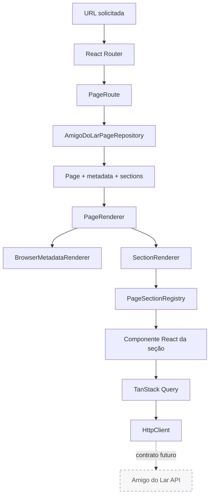

# Arquitetura do Amigo do Lar v2

## Visão técnica

O Amigo do Lar v2 é uma aplicação React composta sobre o Logos Page Engine. A aplicação define conteúdo, rotas, navegação e componentes próprios; o engine oferece contratos e um pipeline genérico para transformar uma `Page` em seções React.

A arquitetura atual privilegia conteúdo estático tipado e geração no build. A camada HTTP e o TanStack Query preparam a evolução para fontes remotas sem tornar a API uma dependência do catálogo público atual.

## Fluxo principal



Até `Component`, o fluxo está ativo para as páginas públicas. TanStack Query e `HttpClient` já estão disponíveis e são usados pela feature de solicitação de orçamento, mas o catálogo permanece local e a API completa é uma dependência futura.

## Divisão por camadas

### `src/domain`

Contém contratos independentes de React:

- `Page`, `PageSection` e o mapa tipado de payloads;
- `PageMetadata` e `RobotsMetadata`;
- contratos e resolvers puros de rotas e navegação.

O domínio descreve o que uma página contém; não decide como ela será apresentada nem de onde os dados vieram.

### `src/engine`

Implementa o pipeline reutilizável:

- `PageRepository` define a porta de acesso às páginas;
- `PageRenderer` aplica metadata e percorre as seções;
- `SectionRenderer` resolve o componente registrado;
- `PageSectionRegistry` associa tipos de seção a componentes;
- `BrowserMetadataRenderer` sincroniza metadata na navegação do browser.

O registry é injetado por contexto, permitindo que cada aplicação componha seus próprios renderizadores.

### `src/apps/amigo-do-lar`

É a aplicação comercial concreta. Concentra:

- catálogo de serviços e áreas;
- fábrica de páginas, conteúdo e JSON-LD;
- rotas e navegação;
- repository em memória;
- componentes, seções e estilos;
- analytics opcional;
- configuração e fundação de API;
- feature de solicitação de orçamento.

### `src/shared`

Reúne infraestrutura reutilizável que não pertence ao produto visual. Atualmente contém o cliente HTTP, tipos de requisição e erros de transporte.

### `scripts`

Orquestra o build estático:

1. carrega a entrada SSR;
2. gera sitemap e robots a partir das rotas públicas;
3. prerenderiza HTML por rota;
4. valida metadata e conteúdo técnico;
5. remove o bundle SSR intermediário de `dist/`.

## Modelo de página e Page Engine

Uma página possui identidade, slug, metadata e uma coleção ordenada de seções. `PageSection` é uma união discriminada: cada `type` determina o payload aceito. A aplicação registra um componente para cada seção utilizada.

```text
Page
├── metadata
└── sections[]
    ├── id
    ├── type
    └── data tipado pelo type
```

Adicionar conteúdo ou uma nova página normalmente altera o catálogo e a fábrica da aplicação, sem modificar `PageRenderer`. Um novo tipo de seção exige contrato no domínio, componente e registro na composição da aplicação.

## Roteamento e renderização

`publicRoutes` deriva das páginas criadas pela fábrica. A mesma lista alimenta:

- configuração do React Router;
- entrada SSR;
- prerenderização;
- sitemap.

No browser, `PageRoute` resolve a página no repository, constrói breadcrumbs e entrega o modelo ao engine. No build, `entry-server.tsx` usa `StaticRouter` e cria um `QueryClient` isolado para cada render, evitando compartilhamento de cache entre páginas.

## Dados e integração futura

O catálogo público ainda é definido em TypeScript. A infraestrutura de integração existente inclui:

- `HttpClient` baseado em `fetch`;
- URL-base validada com Zod;
- timeout e cancelamento;
- erros HTTP, de rede e timeout diferenciados;
- conversão centralizada para mensagens de interface;
- `QueryClient` com políticas explícitas de cache e retry;
- mutation para criar uma solicitação de orçamento.
- health/readiness services e diagnóstico de conectividade exclusivo de desenvolvimento.

Os contratos da API são provisórios. Autenticação, RBAC, catálogo remoto e persistência garantida do orçamento não fazem parte do estado concluído. A migração para dados remotos deverá preservar os contratos de domínio ou introduzir adapters explícitos entre payloads da API e páginas.

## Decisões e limites

- A prerenderização reflete os dados disponíveis no momento do build.
- O cliente mantém navegação SPA após a hidratação.
- A Vercel fornece fallback de rotas por `vercel.json`.
- Analytics só é carregado quando os IDs correspondentes são configurados.
- Não existe frontend administrativo, autenticação ou controle de acesso no runtime atual.

Para decisões anteriores, consulte os [RFCs](rfcs/README.md). Para detalhes do HTML gerado, consulte [SEO.md](SEO.md).
